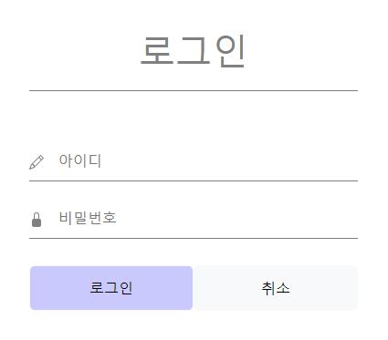
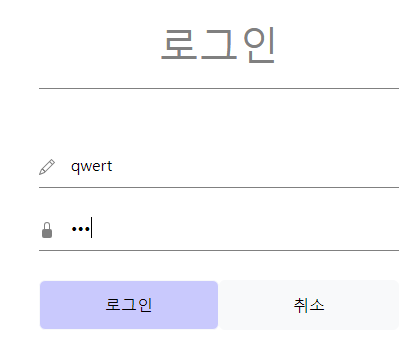
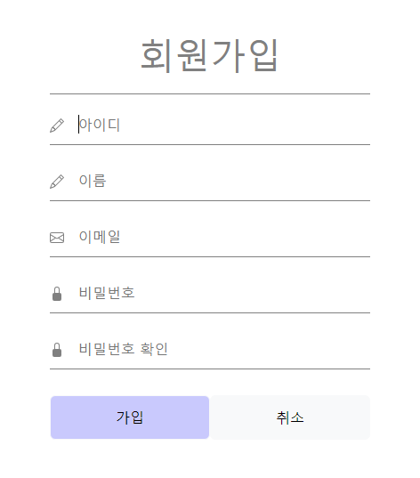
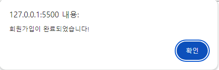
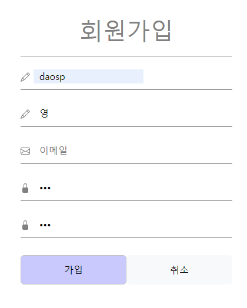
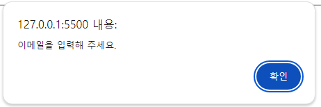

# 2팀 관통 프로젝트 결과 보고
## 목차
1. 구현기능
2. git Review
   
## 1. 구현 기능

- 사용된 기술
  - Bootstrap: 페이지 레이아웃 및 스타일링.
  - Swiper: 슬라이드 쇼 구현.
  - Font Awesome: 아이콘 제공.

- 메인 화면 설명
  - nav 태그
    - Home : 홈화면으로 돌아오기
    - 헬스장찾기 : 누르면 근처 헬스장 지도 링크로 넘어감
    - 회원가입 : 회원가입 html
    - 로그인 : 로그인 html
    - 정보관리(~~회원정보수정~~, 찜영상, ~~내가쓴리뷰~~, ~~팔로우~~) : 
    - 리뷰관리(리뷰작성, 리뷰보기)
    - 로그인 사용자 정보 출력 : **로그인한 사용자 정보**님 안녕하세요! 
    - 부위 검색 : ex) **"등"** 검색시 유튜브에 **"등 운동"** 으로 url 이동

 - 헬린이를 위한 div, 헬창을 위한 div
   - 헬린이와 헬창을 위한 맞춤 영상 제공
         ~~안그래보인다구요..? 헬린이일수록 강해져야하는 법.~~
  - 사진 클릭시 해당 영상 url로 이동
  - 해당 부위를 아이콘으로 만들어 등, 하체, 어깨 등으로 게시함
  - 옆에 찜 버튼을 누르면 찜 목록으로 해당 영상 이동
  - swiper 사용하여 영상이 많아도 가로로 넘어가게함

- 찜 화면 설명
  - 찜 버튼을 클릭하면, 영상이 사용자의 찜 목록에 추가되고 찜 목록은 로컬 스토리지에 저장되어 사용자가 페이지를 새로고침해도 유지됨
  - 찜한 항목 페이지는 사용자가 찜한 영상 목록을 Swiper를 이용해 보여줌.
  - 로컬 스토리지에서 찜 목록을 가져와 Swiper 슬라이드에 동적으로 추가
  - 찜 목록에 추가하는 여부는 confirm을 사용하였음

 

# 로그인 화면 설명
### 로그인 구현 화면

---
### 값 입력되는 화면

---

# 회원가입 화면 설명
### 초기 구현 화면

---
### 모든 값 입력 후 가입 버튼 눌렀을 때 confirm화면 구현완료
  

---
### 아래 사진처럼 값을 전부 입력 안했을 때 

---
### 특정 값이 입력되지 않았다는 알림 구현

---

# 리뷰 작성 화면 설명
### 등록 버튼을 눌렀을 때, 리뷰 목록에 리스트에 추가가 된다.

### 취소 버튼을 눌렀을 때, 리뷰 목록 화면으로 이동한다.

# 리뷰 보기 화면 설명
- 